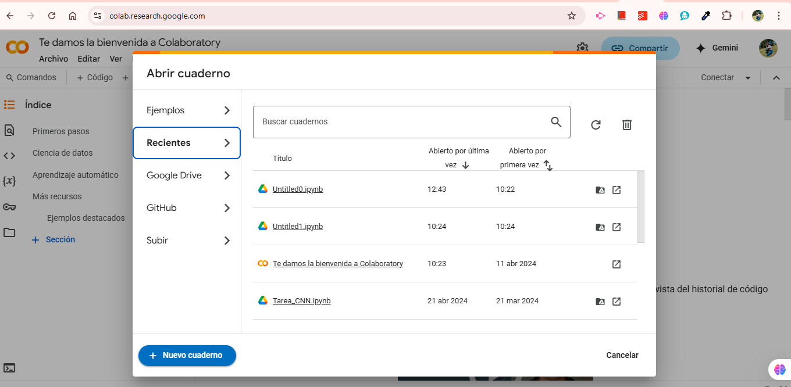
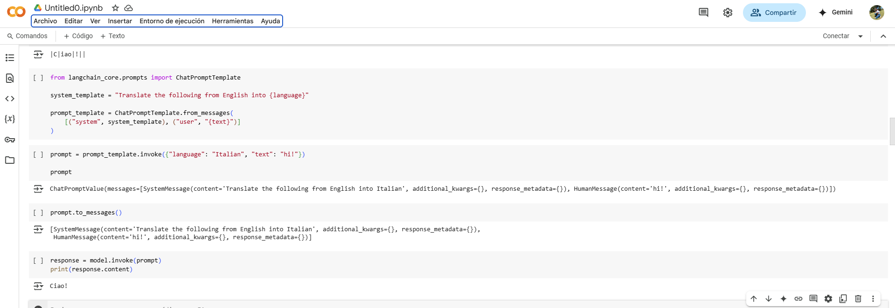

# Construcción de una Aplicación Simple de LLM con LangChain

## Descripción

Este repositorio contiene  las instrucciones necesarias para obtener y ejecutar una aplicación simple de Modelo de Lenguaje (LLM) desarrollada 
LangChain. La aplicación realiza la traducción de texto desde el inglés hacia otro idioma, usando un 
de chat y plantillas de instrucciones.

---

## Arquitectura y Componentes del Proyecto

La aplicación se estructura por medio de los siguientes componentes:

- **Modelo de Lenguaje:** Es el elemento central encargado de realizar las traducciones, en este caso, se utiliza el modelo GPT de OpenAI.
- **Plantillas de Instrucciones:** Facilitan la organización de la entrada para el modelo de lenguaje, fusionando instrucciones predefinidas con los datos proporcionados por el usuario.
- **Interfaz de Transmisión:** Permite la transmisión en tiempo real de los tokens generados por el modelo.
- **Configuración del Entorno:** Contiene las indicaciones necesarias para la instalación y configuración de la clave API.


---

## 📍 Comenzando

Estas instrucciones te permitirán:

- Utilizar modelos de lenguaje dentro de LangChain.
- Crear y aplicar plantillas de instrucciones para organizar las entradas.
- Interactuar con modelos de chat y manejar respuestas en tiempo real.

### 🔧 Prerrequisitos
- Python 3.7 o superior.
- Una clave API válida de OpenAI.

### ⚙️ Instrucciones paso a paso 

- Iniciamos sesión en https://colab.google/

<p align="center">

</p>

- Seleccionamos Nuevo Cuaderno

<p align="center">

</p>


- y procedemos a ejecutar todos los fragmentos de codigo a continuación los ejecutamos en el cuadreno de jupyter


1) **Instalar LangChain:¨** Se hace la instalación usando pip.

   Para instalar LangChain, ejecuta el siguiente comando:
   ```bash
   pip install langchain


2) **Instalar Dependencias Adicionales:** Dado que se usa un modelo de chat de OpenAI, instalamos las dependencias necesarias:
   ```bash
   pip install -qU "langchain[openai]"
   ```

3) **Configuramos la Clave API de OpenAI:** Clave API de OpenAI como una variable de entorno. 

   En la Terminal:
   ```bash
   export OPENAI_API_KEY="tu-clave-api-aquí"
   ```

   En un cuaderno Jupyter:
   ```python
   import getpass
   import os

   if not os.environ.get("OPENAI_API_KEY"):
       os.environ["OPENAI_API_KEY"] = getpass.getpass("Introduce tu clave API para OpenAI: ")
   ```


---

## Ejecución del Código

### Paso 1: Configuración del Modelo de Chat

Primero, se configura el modelo de chat, utilizando LangChain:

```python
from langchain.chat_models import init_chat_model

model = init_chat_model("gpt-4o-mini", model_provider="openai")
```

### Paso 2: Interactuar con el Modelo

Se configura el modelo pasando un conjunto de mensajes. En este caso, se traduce "hi!" de inglés a italiano:

```python
from langchain_core.messages import HumanMessage, SystemMessage

messages = [
    SystemMessage("Translate the following from English into Italian"),
    HumanMessage("hi!"),
]

response = model.invoke(messages)
print(response.content)  # Resultado: Ciao!
```

### Paso 3: Recibir Respuestas en Tiempo Real

LangChain permite que se reciban tokens conforme se generen. 
Asi se transmite la respuesta:

```python
for token in model.stream(messages):
    print(token.content, end="|")
```

**Resultado esperado:**

```
|C|iao|!|
```


Anexo funcionamiento:

<p align="center">

</p>


### Uso de Plantillas de Instrucción

#### Paso 1: Crear una Plantilla de Instrucción

Las plantillas de instrucción  permiten estructurar mejor la entrada para el modelo.
Para crear una plantilla se requieren dos variables:

- **language:** El idioma al que se traducirá el texto.
- **text:** El texto que se va a traducir.

```python
from langchain_core.prompts import ChatPromptTemplate

system_template = "Translate the following from English into {language}"
prompt_template = ChatPromptTemplate.from_messages(
    [("system", system_template), ("user", "{text}")]
)
```

#### Paso 2: Formatear y Aplicar la Plantilla

Ahora se puede personalizar la plantilla con la entrada del usuario y pasársela al modelo 
para su ejecución:

```python
prompt = prompt_template.invoke({"language": "Italian", "text": "hi!"})
response = model.invoke(prompt)
print(response.content)  # Resultado: Ciao!
```

#### Paso 3: Revisar la Plantilla

Para revisar como  organizar la entrada en la plantilla, puede inspeccionarse con el siguiente
comando:

```python
prompt.to_messages()
```

**Resultado esperado:**

```python
[
    SystemMessage(content='Translate the following from English into Italian'),
    HumanMessage(content='hi!')
]
```

### Ejemplo de Ejecución de la Aplicación

En este caso, para traducir "Hello!" al francés:

**Entrada:**

```python
prompt = prompt_template.invoke({"language": "French", "text": "Hello!"})
response = model.invoke(prompt)
print(response.content)
```

**Resultado esperado:**

```
Bonjour!
```


----

## 👨🏼‍💻 Autora

**Saray Alieth Mendivelso Gonzalez** 

---
